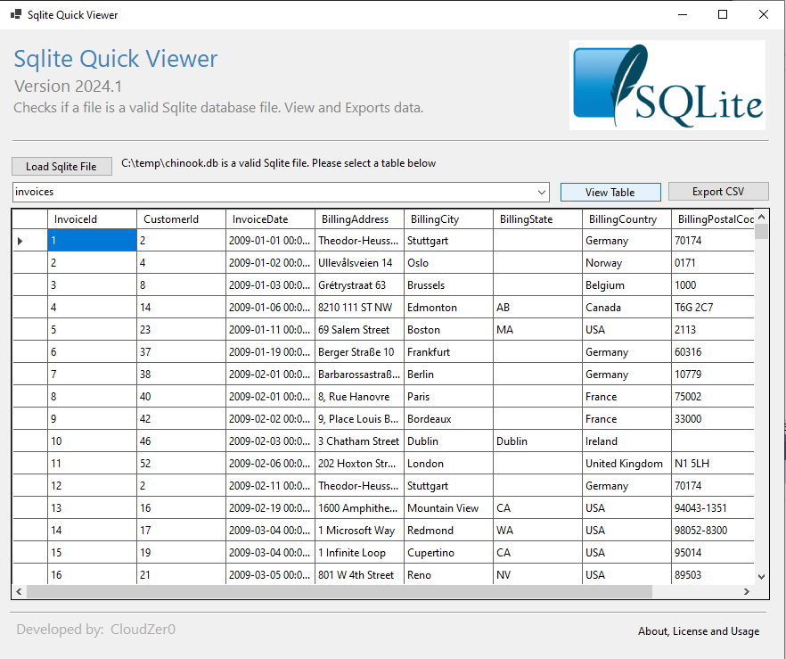

# Project:  Sqlite Quick Viewer
- Version:  1.0
- Last commit, update:  19 June 2024
- Developer:  CloudZer0

**Functions**
- Check for a valid sqlite database file.
- Read all tables of a valid sqlite database file.
- View Table(s)
- Export table to csv.

**Application download**
- Microsoft Store - Sqlite Quick Viewer

**Example database**
- chinnook.db

**Dev platform** 
- Windows Forms, Visual Studio 2022
- Microsoft Visual Studio Community 2022 (64-bit) - Current Version 17.10.1
- C#

**Customizations and Support**
- cloudzero.za@gmail.com

